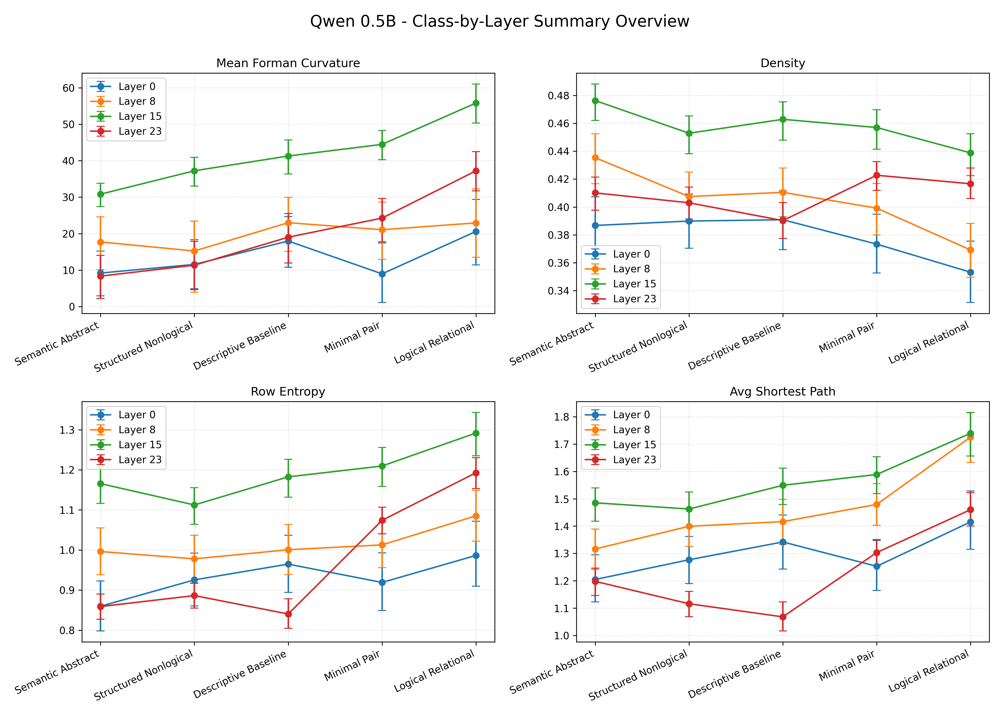

***

# Formal Constraint and Routing Reorganization in Transformer Attention

**Author:** Matthew A. Pender

**Preprint / Zenodo DOI:** 



## Overview

## Dependencies

## Repository Structure

The repository is organized as follows:

```text
llm_constrained_tranpsort/
│
├── src/     
│   ├── run_prompt_panel.py
│   ├── summarize_results.py
│   └── plot_results.py
│
├── prompts/
│   └── prompt_set_v1.csv
│
└── results/
    ├── gpt2/
    │   └── figures/
    │
    └── qwen_0p5b/
        └── figures/
```

## How to Replicate the Study


### Step 1

GPT data

$env:OMP_NUM_THREADS="1"; $env:MKL_NUM_THREADS="1";

```bash
python src/run_prompt_panel.py --prompt_csv prompts/prompt_set_v1.csv --model_name gpt2 --layers 8 11 --edge_threshold 0.01 --output_dir results/gpt2 --save_graph_payloads
```

Qwen data

```bash
python src/run_prompt_panel.py --prompt_csv prompts/prompt_set_v1.csv --model_name Qwen/Qwen2.5-0.5B --auto_n_layers 4 --edge_threshold 0.01 --output_dir results/qwen_0p5b --save_graph_payloads --device cuda --torch_dtype float16
```

Summarize GPT

```bash
python src/summarize_results.py --input_csv results/gpt2/raw_head_metrics.csv --output_dir results/gpt2/summaries
```

Summarize Qwen

```bash
python src/summarize_results.py --input_csv results/qwen_0p5b/raw_head_metrics.csv --output_dir results/qwen_0p5b/summaries
```

Plot GPT

```bash
python src/plot_results.py --class_layer_csv results/gpt2/summaries/class_layer_summary.csv --class_layer_head_csv results/gpt2/summaries/class_layer_head_summary.csv --minimal_pair_csv results/gpt2/summaries/minimal_pair_differences.csv --graph_payload_manifest_csv results/gpt2/graph_payload_manifest.csv --output_dir results/gpt2/figures --model_label "GPT-2"
```

Plot Qwen

```bash
python src/plot_results.py --class_layer_csv results/qwen_0p5b/summaries/class_layer_summary.csv --class_layer_head_csv results/qwen_0p5b/summaries/class_layer_head_summary.csv --minimal_pair_csv results/qwen_0p5b/summaries/minimal_pair_differences.csv --graph_payload_manifest_csv results/qwen_0p5b/graph_payload_manifest.csv --token_metadata_csv results/qwen_0p5b/tokenized_prompt_metadata.csv --output_dir results/qwen_0p5b/figures --model_label "Qwen 0.5B"
```
